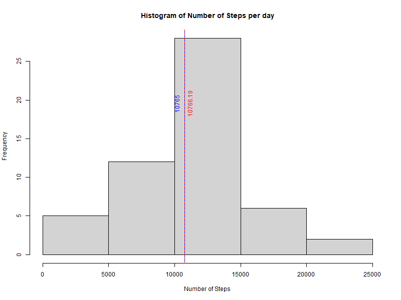
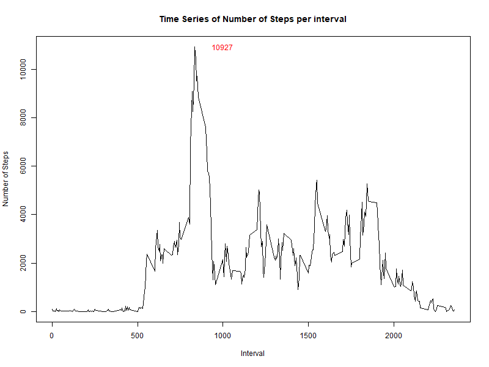
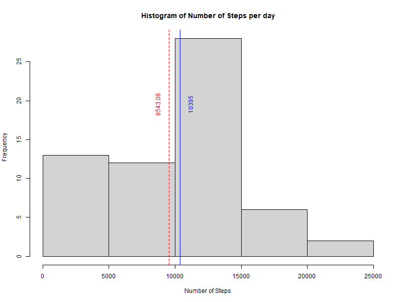
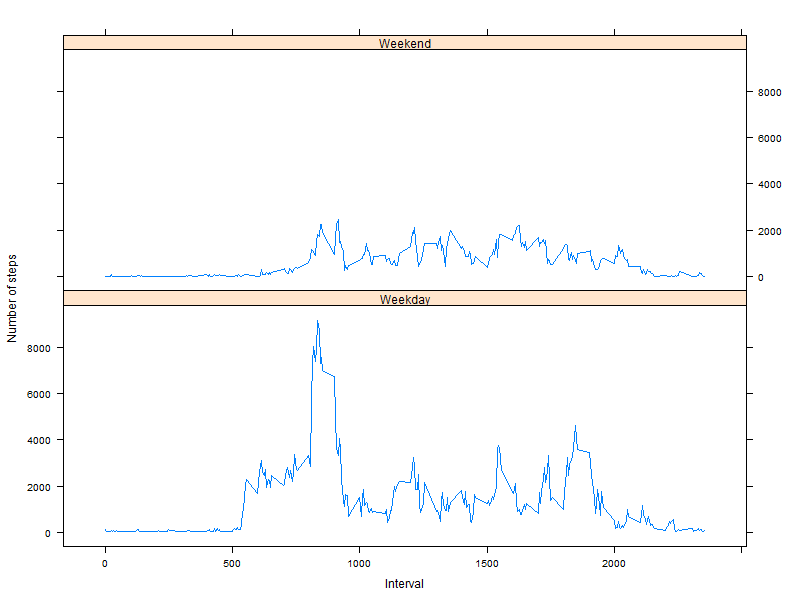

### What is mean total number of steps taken per day?

#### Mean is in RED and Medain is in BLUE
 

### What is the average daily activity pattern?

 

### Imputing missing values

#### Mean is in RED and Medain is in BLUE

 
 

### Are there differences in activity patterns between weekdays and weekends?

 
